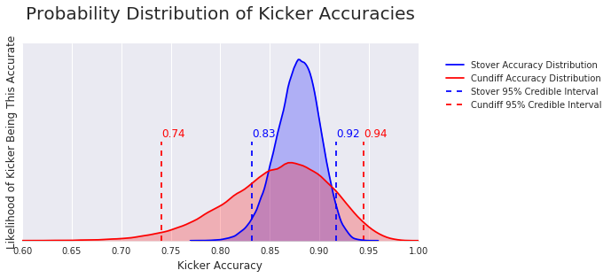
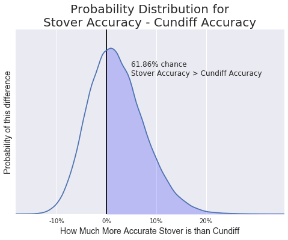

# Bayesian Inference to Compare two NFL Kickers using Pymc3

## January 2017 Portfolio Project, using BeautifulSoup to perform webscraping and pymc3 to implement probabalistic programming

You're the chief data scientist of a foobtall team, and you're facing a difficult decision. You're in the head office with the general manager and the team owner, and you're getting ready to sign a new kicker to the team. His name is Matt Stover, and his agent boasts that he made 178 out of 200 field goals - 89%.

Suddenly, another agent waltzes in. "Wait!" he says. "I represent Billy Cundiff, the hot young kicker who's made 95% of his attempts. We're asking for the same amount Stover is, despite having a higher average. It's a steal!"

"Oh come on," says the first agent, rolling his eyes. "He made 95% because he's only taken 20 kicks and happened to make 19 of them. He got lucky and he's trying to cash in. 20 kicks probably tells us next to nothing! Stover is at least 5% better than most young kickers; I bet he's at least 3% better than Cundiff."

"Teams are always looking for the next great kicker. Are you looking for a great kicker, or just an acceptabe one?" asks Cundiff's agent. "You know what you're getting with Stover, but Cundiff has a chance to be great."

The general manager looks to you. "What do you think? Is making 19 out of 20 kicks enough evidence to conclude that young Cundiff is better than the established Stover? Or do we think he got lucky?"

What's your intuition?

---

## Three Questions:

A) General Manager's Question: How likely is Cundiff to be more accurate than Stover?

B) Stover's Agent's Claim: How likely is Stover to be at least 5% more accurate than Cundiff?

C) Cundiff's Agent's Claim: If having an accuracy of over 92% counts as great, how much more likely is Cundiff to be a 'great' kicker compared to Stover?

---

### Modeling the Kickers

Typical null hypothesis significance testing would ask: "If the two kickers were equally skilled, what are the chances that we would see their averages differ this much or more?" Applying a chi-squared contingency test, we would find that p > .65, indicating that there's a decent chance the kickers are equally good, and we can't reject the null hypothesis.

Fortunately, you were trained to use Bayesian techniques. Instead of addressing "Given a null hypothesis, how likely are these results?" it tries to answer "Given these results, how likely do we think different hypotheses are?" This is what we actually want to know.

The knock against Bayesian methods is typically that they are computationally expensive (which is less and less of a concern) and are somewhat subjective because they require you to have prior beliefs to use as a jumping-off point. For example, if you think that rookie kickers almost never have over 90% accuracy, it would seem far more likely that Cundiff got lucky rather than actually being that good. On the other hand, if you think it's well within the range of possibility that a rookie has 95% accuracy, there's less reason to resort to luck as an explanation for his success.

Bayesianism can certainly be subjective, but it works best when you can use informed priors. In this case, I scraped the NFL.com website to get real season percentages for rookie kickers who attempted at least 20 kicks in their first year.

Using these data to form priors about how accurate kickers are when they start, we want to know how likely each possible accuracy would be to produce the results we saw - Stover making 178 of 200 and Cundiff making 19 of 20. 

The pymc3 library makes this easy - it takes tens of thousands of steps to converge on the distributions that best fit our data. The resulting distributions represent our belief of how likely different accuracies are. If we want to know how likely a kicker is to have an accuracy over .8, we just look at what portion of the probability distribution's area falls to the right of .8.   

By the end, we have probability distributions we can compare.  Stover's a known quantity, with a narrow range of accuracies - our 95% credible interval indicates that we think his accuracy is likely to be between 83.2% and 91.7%.  Cundiff is a bit more of a mystery - his 20 kicks make us think his accuracy is likely to be between 74.1% and 94.4%.

Because these are bayesian probability distributions of how likely we think different accuracies are, we can answer our 3 questions directly.  

**A) General Manager's Question: How likely is Stover to be more accurate than Cundiff?**

61.9% of the probability distribution has Stover's accuracy higher than Cundiff's. 

**B) Stover's Agent's Claim: How likely is Stover to be at least 3% more accurate than Cundiff?**

Stover's accuracy was over .03 higher than Cundiff's in 40.7% of the probability distribution - his agent was incorrect, underestimating how much information we gained from Cundiff's 19 of 20 successful kicks.

**C) Cundiff's Agent's Claim: If having an accuracy of over 92% counts as great, how much more likely is Cundiff to be a 'great' kicker compared to Stover?**

1.75% of Stover's Accuracy Probability Distribution was over .92, compared to 10.4% of Cundiff's, making Cundiff almost 6 times more likely to be a 'great' kicker. Stover is a known quantity, and while it's very likely he's good, he's unlikely to be great. 

