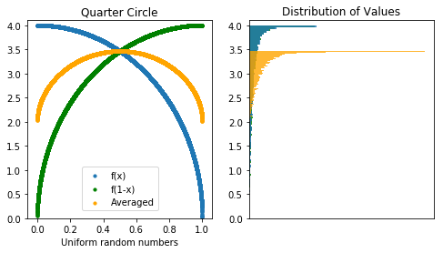

If I gave you 10,000 random numbers between 0 and 1, how precisely could you estimate pi? It's Pi Approximation Day (22/7 in the European format), which seems like the perfect time to share some math! 	

When we're modeling something complex and either can't or don't want to bother to find a closed-form analytic solution, we can find a way to get close to the answer with a Monte Carlo simulation. The more precisely we want to estimate the answer, the more simulations we would create. 

One classic Monte Carlo approach to find pi is to treat our 10,000 numbers as the x and y coordinates of 5,000 points in a square between (0,0) and (1,1). If we draw a unit circle at (0,0), the percent of the points which land inside the circle gives us a rough estimate of the area - which should be pi / 4\. Multiply by 4, and we have our estimate. 

> simulated mean:  3.1608

> 95% confidence interval: 3.115 - 3.206

> confidence interval size: 0.091

This technique works, but it's not the most precise. There's a fair bit of variance - a 95% confidence interval is about .09 units wide, from 3.12 to 3.21\. Can we do better? 

Another way to find the quarter-circle's area is to treat it as a function and take its average value. (Area is average height times width, the width is 1, so the area inside the quarter-circle is just its average height.) That would give us pi/4, so we multiply by 4 to get our estimate for pi. 

y^2+x^2=1

y^2=1-x^2

f(x)=√(1-x^2)

We have 10,000 random numbers between 0 and 1; all we have to do is calculate f(x) for each and take the mean:

> simulated mean:  3.1500

> 95% confidence interval: 3.133 - 3.167

> confidence interval size: 0.0348

This gives us a more precise estimate; the 95% confidence interval is less than half what it was! But we can do better.

### Antithetic Variates

What happens if we take our 10,000 random numbers and flip them around? They're just a set of points uniformly distributed between 0 and 1, so (1-x) is also a set of points uniformly distributed between 0 and 1\. If the expected value of f(x) is pi with variance 0.1, then the expected value of f(1-x) should also be pi with variance of 0.1. 

So how does this help us? It looks like we just have two different ways to get the same level of precision. 

Well, if f(x) is particularly high, then f(1-x) is going to be particularly low. By pairing each random number with its converse , we can offset some of the error and get an estimation more closely centered around the true mean. Taking the average of two distributions, each with the same expected value should still give us the same answer. 

(This trick, known as using **[antithetic variates](https://en.wikipedia.org/wiki/Antithetic_variates)**, doesn't work with every function, but works here because the function f(x) always decreases as x increases.) 

> simulated mean:  3.1389

> 95% confidence interval: 3.132 - 3.145

> confidence interval size: 0.0131

Lo and behold, our 95% confidence interval has narrowed down to 0.013, still only using 10,000 random numbers! To be fair, this only beats 22/7 about 30% of the time with 10,000 random simulations. Can we reliably beat the approximation without resorting to more simulations?

### Control Variates

It turns out we can squeeze a bit more information out of those randomly generated numbers. If we know the exact expected value for a part of the function, we can be more deliberate about offsetting the variance. In this case, let's use c(x)=x^2 as our "[control variate](https://en.wikipedia.org/wiki/Control_variates) function", since we know that the average value of x^2 from 0 to 1 is exactly 1/3. 

Where our simulated function was

f(x)=√(1-x^2)

now we add a term that will have an expected value of 0, but will help reduce variance: 

f'(x)=√(1-x^2)+b(x^2-(1/3))

or each of our 10,000 random x's, if x^2 is above average, we know that f(x) will probably be a bit *below* average, and we nudge it up. If x^2 is below average, we know f(x) is likely a bit high, and nudge it down. The overall expected value doesn't change, but we're compressing things even further toward the mean. 

The constant 'b' in our offset term determines how much we 'nudge' our function, and is estimated based on how our control variate covaries with the target function: 

Covariance(f(x), c(x)) / Variance(c(x))

(In this case, b is about 2.9) Here's what we get: 

> simulated mean:  3.1412

> 95% confidence interval: 3.1381 - 3.1443

> confidence interval size: 0.0062

See how the offset flattens our new function (in orange) to be tightly centered around 3.14? 

This is pretty darn good. Without resorting to more simulations, we reduced our 95% confidence interval to 0.006.  This algorithm gives a closer approximation to pi than 22/7 about 57% of the time. 

If we're not bound by the number of random numbers we generate, we can get as close as we want. With 100,000 points, our control variates technique has a 95% confidence interval of 0.002, and beats 22/7 about 98% of the time. 

These days, as computing power gets cheaper, we can generate 100,000 or even 1,000,000 random numbers with no problem. That's what makes simulations so versatile - we can find ways to simulate even incredibly complicated processes and unbounded functions, deciding how precise we need to be. Happy Pi Approximation Day! 

(You may ask, why is there a "Pi Approximation Day" and not a "Pi Simulation Day"? Well, according to Nick Bostrom, every day is Simulation Day. Probably.)