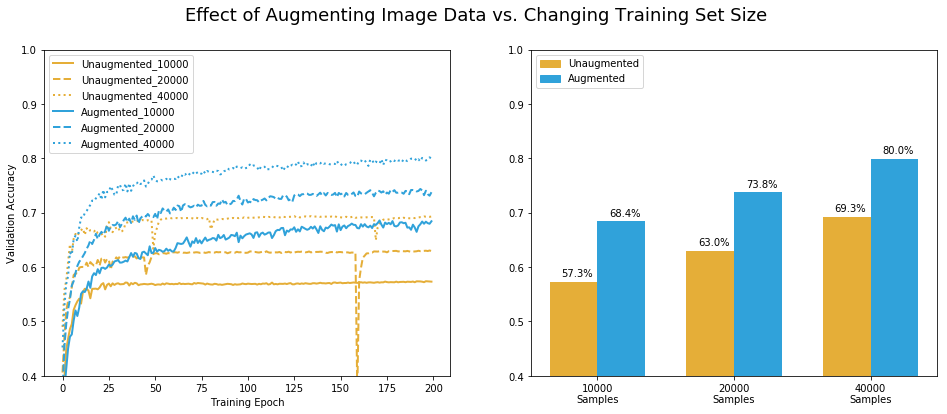

## Improving Image Classification with Data Augmentation: Pretending you have more data than you do

### Image Processing, Convolutional Neural Nets, Keras Deep Learning Library, Data Augmentation

In building a good image-recognition neural net, having more pictures for training can make a real difference -- but can be expensive. Rather than paying a grad student to go take and label more pictures, you can be creative and reuse the images you have.

To demonstrate, I designed a convolutional neural net with Keras to classify images from the standard CIFAR-10 dataset and trained them for 200 epochs on 10,000, 20,000, and 40,000 training images. Their performance leveled off after 20-40 training epochs, scoring 57.3%, 63.0%, and 69.3% accuracy respectively.

That's a big improvement, but now we're out of data.

... unless we take our images and flip them horizontally. Voila, 40,000 new images! For every dog, cat, and truck facing left, we have a picture of it facing right. They're not as original as brand-new pictures, but they still help the neural net learn to recognize patterns and generalize to unseen data.

In fact, as long as the resulting image is still representative of what we expect to see in the test set (or real world), it can be helpful in training the model to generalize beyond the original data -- we can do all sorts of things to adjust the image beyond horizontal mirroring.

I wrote a data generator to automatically augment the data during training - feeding the neural net a stream of images each with one of seven image transformations at varying intensities: Rotation, Horizontal Flipping, Translation Left/Right, Translation Up/Down, Sharpening, Contrast, and Brightness. 

Adding data augmentation made it more difficult for the neural net to overfit its weights to the exact images in its training set, and allowed for longer improvement in performance.

Even without any additional fine-tuning, there was a big difference -- models that augmented their data during training got over 10% higher accuracy scores when tested on unseen images. In fact, using data augmentation was more effective than doubling the size of the training set!

I was impressed to see that the model using augmented data based on 10,000 training images scored 68.4% accuracy on unseen data. That's within one percent of the unaugmented model which was given 40,000 training images!

(And actually, since each epoch updates the weights for each batch of 128 images in the training set, the un-augmented model with 40,000 samples had four times as many updates. If allowed to train longer, the augmented model with 10,000 may surpass it.)

PS - As is often the case, Keras now has built-in functionality to do this, but I wanted to demonstrate more of the concept for myself.

