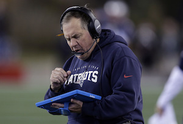

# Evaluating NFL Playcalling Predictability 

## Controling for multiple non-linear confounding variables using a gradient boosting classifer to apply inverse probability of treatment weighting

In football, it pays to be unpredictable (although the "[wrong way touchdown](https://www.youtube.com/watch?v=l1UZy7SSdDI)" might be taking it a bit far.) If the other team picks up on an unintended pattern in your play calling, they can take advantage of it and adjust their strategy to counter yours. Coaches and their staff of coordinators are paid millions of dollars to call plays that maximize their team's talent and exploit their opponent's weaknesses. That's why it surprised Brian Burke, formerly of AdvancedNFLAnalytics.com (and now hired by ESPN) to see a [peculiar trend](http://archive.advancedfootballanalytics.com/2008/09/predictability-on-2nd-and-10.html): football teams seem to rush a remarkably high percent on 2nd and 10 compared to 2nd and 9 or 11. What's causing that? 

 

His insight was that 2nd and 10 disproportionately followed an incomplete pass. This generated two hypotheses:

1.  Coaches (like all humans) are bad at generating random sequences, and have a tendency to alternate too much when they're trying to be genuinely random. Since 2nd and 10 is most likely the result of a 1st down pass, alternating would produce a high percent of 2nd down rushes.
2.  Coaches are suffering from the 'small sample fallacy' and 'recency bias', overreacting to the result of the previous play. Since 2nd and 10 not only likely follows a pass, but a failed pass, coaches have an impulse to try the alternative without realizing they're being predictable.

These explanations made sense to me, and I [wrote about phenomenon a few years ago](https://measureofdoubt.com/2011/06/15/game-theory-and-football-how-irrationality-affects-play-calling/). But now that I've been learning data science, I can dive deeper into the analysis and add a hypothesis of my own. The following work is based on the [play-by-play data for every NFL game](http://archive.advancedfootballanalytics.com/2010/04/play-by-play-data.html) from 2002 through 2012, which Brian kindly posted. I spend some time processing it to create variables like Previous Season Rushing %, Yards per Pass, Yards Allowed per Pass by Defense, and QB Completion percent.

## Irrationality? Or Confounding Variables?

Since this is an observational study rather than a randomized control trial, there are bound to be confounding variables. In our case, we're comparing coaches' play calling on 2nd down after getting no yards on their team's 1st down rush or pass. But those scenarios don't come from the same distribution of game situations. A number of variables could be in play, some exaggerating the trend and others minimizing it. For example, teams that passed for no gain on 1st down (resulting in 2nd and 10) have a disproportionate number of inaccurate quarterbacks (the left graph). These teams with inaccurate quarterbacks are more likely to call rushing plays on 2nd down (the right graph). Combine those factors, and we don't know whether any difference in play calling is caused by the 1st down play type or the quality of quarterback. 

 

The classic technique is to train a regression model to predict the next play call, and judge a variable's impact by the coefficient the model gives that variable. Unfortunately, models that give interpretable coefficients tend to treat each variables as either positively or negatively correlated with the target - so time remaining can't be positively correlated with a coach calling running plays when the team is losing and negatively correlated when the team is winning. Since the relationships in the data are more complicated, we needed a model that can handle it. 

I saw my chance to try a technique I learned at the Boston Data Festival last year: Inverse Probability of Treatment Weighting. 

In essence, the goal is to create artificial balance between your 'treatment' and 'control' groups -- in our case, 2nd and 10 situations following 1st down passes vs. following 1st down rushes. We want to take plays with under-represented characteristics and 'inflate' them by pretending they happened more often, and - ahem - 'deflate' the plays with over-represented features.

To get a single metric of how over- or under-represented a play is, we train a model (one that can handle non-linear relationship better) to take each 2nd down play's confounding variables as input - score, field position, QB quality, etc - and tries to predict whether the 1st down play was a rush or pass. If, based on the confounding variables, the model predicts the play was 90% likely to be after a 1st down pass - and it was - we decide the play probably has over-represented features and we give it less weight in our analysis. However, if the play actually followed a 1st down rush, it must have under-represented features for the model to get it so wrong. Accordingly, we decide to give it more weight. 

After assigning each play a new weight to compensate for its confounding features (using Kfolds to avoid training the model on the very plays it's trying to score), the two groups *should* be balanced. It's as though we were running a scientific study, noticed that our control group had half as many men as the treatment group, and went out to recruit more men. However, since that isn't an option, we just decided to count the men twice.

## Testing our Balance

Before processing, teams that rushed on 1st down for no gain were disproportionately likely to be teams with the lead. After the re-weighting process, the distributions are far much more similar: 

 

Much better! They're not all this dramatic, but lead was the strongest confounding factor and the model paid extra attention to adjust for it. It's great that the distributions look more similar, but that's qualitative. To do a quantitative diagnostic, we can take the standard difference in means, recommended as a best practice in a 2015 paper by Peter C. Austin and Elizabeth A. Stuart titled "[Moving towards best practice when using inverse probability of treatment weighting (IPTW) using the propensity score to estimate causal treatment effects in observational studies](http://onlinelibrary.wiley.com/doi/10.1002/sim.6607/full)". For each potential confounding variable, we take the difference in means between plays following 1st down passes and 1st down rushes and adjust for their combined variance. A high standard difference of means indicates that our two groups are dissimilar, and in need of balancing. The standardized differences had a max of around 47% and median of 7.5% before applying IPT-weighting, which reduced the differences to 9% and 3.1%, respectively. 

## Actually Answering Our Question

So, now that we've done what we can to balance the groups, do coaches still call rushing plays on 2nd and 10 more often after 1st down passes than after rushes? In a word, yes. 

 

In fact, the pattern is even stronger after controlling for game situation. It turns out that the biggest factor was the score (especially when time was running out.) A losing team needs to be passing the ball more often to try to come back, so their 2nd and 10 situations are more likely to follow passes on 1st down. If those teams are *still* calling rushing plays often, it's even more evidence that something strange is going on. Ok, so controlling for game situation doesn't explain away the spike in rushing percent at 2nd and 10\. Is it due to coaches' impulse to alternate their play calling? Maybe, but that can't be the whole story. If it were, I would expect to see the trend consistent across different 2nd down scenarios. But when we look at all 2nd-down distances, not just 2nd and 10, we see something else: 

 

If their teams don't get very far on 1st down, coaches are inclined to change their play call on 2nd down. But as a team gains more yards on 1st down, coaches are less and less inclined to switch. If the team got six yards, coaches rush about 57% of the time on 2nd down regardless of whether they ran or passed last play. And it actually reverses if you go beyond that - if the team gained more than six yards on 1st down, coaches have a tendency to repeat whatever just succeeded. It sure looks like coaches are reacting to the previous play in a predictable [Win-Stay Lose-Shift](https://en.wikipedia.org/wiki/Win%E2%80%93stay,_lose%E2%80%93switch) pattern. Following a hunch, I did one more comparison: passes completed for no gain vs. incomplete passes. If incomplete passes feel more like a failure, the recency bias would influence coaches to call more rushing plays after an incompletion than after a pass that was caught for no gain. Before the re-weighting process, there's almost no difference in play calling between the two groups - 43.3% vs. 43.6% (p=.88). However, after adjusting for the game situation - especially quarterback accuracy - the trend reemerges: in similar game scenarios, teams rush 44.4% of the time after an incomplete and only 41.5% after passes completed for no gain. It might sound small, but with 20,000 data points it's a pretty big difference (p < 0.00005) All signs point to the recency bias being the primary culprit.

## Reasons to Doubt:

1) There are a lot of variables I didn't control for, including fatigue, player substitutions, temperature, and whether the game clock was stopped in between plays. Any or all of these could impact the play calling. 

2) Brian Burke's (and my) initial premise was that if teams are irrationally rushing more often after incomplete passes, defenses should be able to prepare for this and exploit the pattern. Conversely, going against the trend should be more likely to catch the defense off-guard. I really expected to find plays gaining more yards if they bucked the trends, but it's not as clear as I would like. I got excited when I discovered that rushing plays on 2nd and 10 did worse if the previous play was a pass - when defenses should expect it more. However, when I looked at other distances, there just wasn't a strong connection between predictability and yards gained. One possibility is that I needed to control for more variables. But another possibility is that while defenses *should* be able to exploit a coach's predictability, they can't or don't. To give Brian the last words:

> But regardless of the reasons, coaches are predictable, at least to some degree. Fortunately for offensive coordinators, it seems that most defensive coordinators are not aware of this tendency. If they were, you’d think they would tip off their own offensive counterparts, and we’d see this effect disappear.