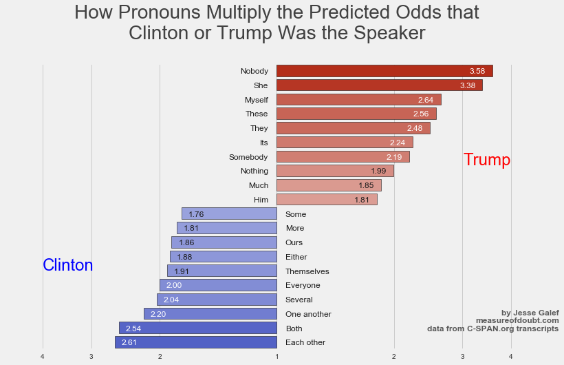
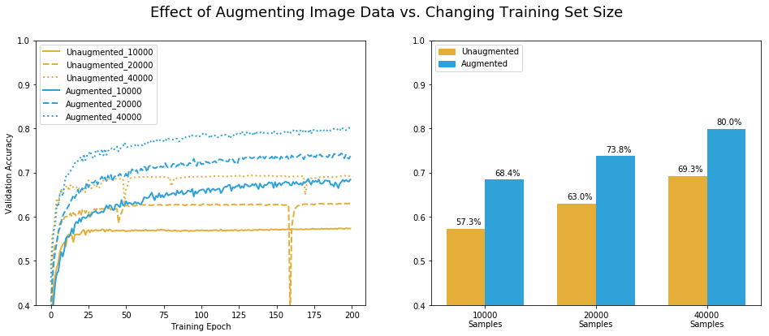
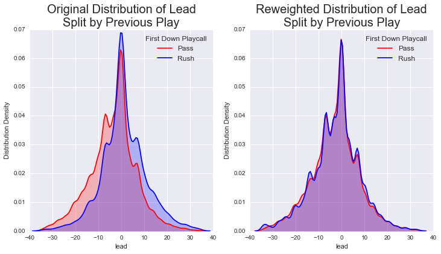
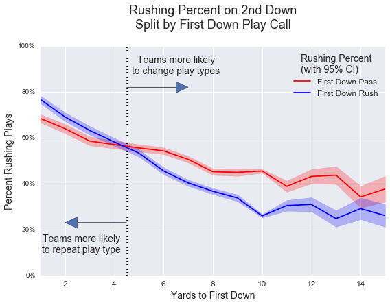
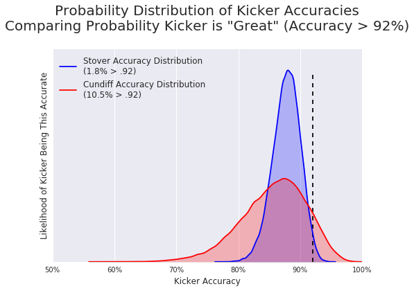
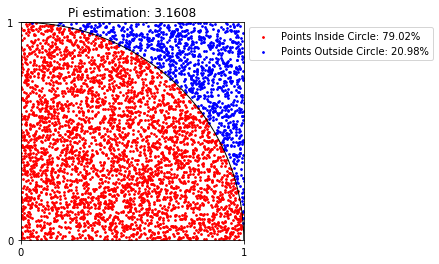
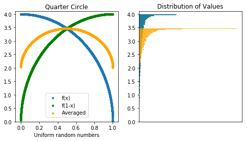

# Jesse Galef Data Science & Machine Learning Portfolio Projects

**[Resume (pdf)](https://github.com/JesseGalef/Portfolio/raw/master/Jesse_Galef_Resume.pdf)** **[LinkedIn](https://www.linkedin.com/in/jessegalef)**

--- 

## [1) Quantifying the 'Trumpiness' of Political Speech Using Natural Language Processing](https://github.com/JesseGalef/Portfolio/tree/master/Trumpiest_Sentences)

### Natural Language Processing, Logistic Regression, Cross Validation, Web Scraping, Visualization, Interactive Visualization with D3

Summary: Donald Trump and Hillary Clinton have fairly distinct speaking styles on the campaign trail, but what makes them distinct? 

This project scrapes transcripts from CSPAN.org to train a model to identify the most important terms for identifying which candidate said a given sentence, and to find the most emblematic sentence for each (The 'Trumpiest', if you will).

In addition to graphs visualizing the results, I created [an interactive D3 JavaScript page](https://rawgit.com/jessegalef/portfolio/master/Trumpiest_Sentences/interactive.html) for visitors to play with the results, enter their own sentences for evaluation, and look up terms.

One result:

## 2) [Regularization Hyperparameter Tuning with Reinforcement Learning:](https://github.com/JesseGalef/Portfolio/tree/master/Hyperparm_Tuning_RL) -- Applying Proximal Policy Optimization to Reduce Overfitting

### Reinforcement Learning, Hyperparameter Tuning, Regularization, Keras Deep Learning Library, Scikit-Learn Linear Models

Summary: Following an idea I saw in [a paper I read](https://arxiv.org/abs/1805.09501) for my Deep Learning class, I wanted to try using reinforcement learning to tune regularization hyperparameters and prevent overfitting. 

The ElasticNet model requires two hyperparameters for regularization, l1_ratio and alpha. The goal is to try a number of random combinations of the two, becoming less random over time as it learns which combinations performed better.

Like the Google Brain paper, I used OpenAI's [Proximal Policy Optimization algorithm](https://spinningup.openai.com/en/latest/algorithms/ppo.html) algorithm to keep the reinforcement learner progressing with steady steps rather than jumping around wildly. I trained it for 100 minibatches of 16 samples, updating its distributions after each minibatch.

The distribution for l1_ratio quickly fell near zero until the values for alpha concentrated around .45, at which point the model began sampling larger l1_ratio values again. When this path is plotted along with the performance of each hyperparameter combination, it looks like the reinforcement learning model was finding the best area to sample from:

Our tuned ElasticNet outperformed the out-of-the-box LassoCV and RidgeCV models but took significantly longer. 

It was fun to learn and demonstrate the process, but unless the extra tiny bit of performance is vital, simpler approaches are likely better when you have so few hyperparameters to tune.

## 3) [Improving Image Classification with Data Augmentation](https://github.com/JesseGalef/Portfolio/tree/master/Image_Augmentation/) -- Pretending you have more data than you do

### Image Processing, Convolutional Neural Nets, Keras Deep Learning Library, Data Augmentation

Summary: In training a neural net, having more training images can make a real difference -- but that can be expensive. Rather than paying a grad student to go take and label more pictures, you can be creative and reuse the images you have.

This project demonstrates the advantages of using data augmentation on the CIFAR-10 dataset to increase a neural net's ability to classify out-of-sample images. By applying simple transformations to the images during training, the same neural net architecture was able to nearly match the performance of a model which was given four times as many training examples.

(And actually, since each epoch updates the weights for each batch of 128 images in the training set, the un-augmented model with 40,000 samples had four times as many updates. If allowed to train longer, the augmented model with 10,000 may surpass it.)

## 4) [Evaluating NFL Play Calling Predictability](https://github.com/JesseGalef/Portfolio/tree/master/NFL_Playcalling) - Controlling for multiple non-linear confounding variables using inverse probability of treatment weighting

### Non-Linear Models (Random Forest Classifiers), Inverse Propensity Score Weighting, Data Visualization, Feature Engineering

Summary: There's a curious pattern in NFL play calling, which we think might be the result of coaches' irrationality. But there are so many confounding variables in play - score, time, QB quality, etc. - that we need to control for those first before passing judgement.

The project is an exercise in feature engineering and the 'inverse probability of treatment weighting' technique of controlling for confounds. These features were disproportionately distributed between the groups I was comparing, but became far more similar after being reweighted.

## 5) [Making Judgements on Limited Information](https://github.com/JesseGalef/Portfolio/tree/master/Bayesian_Inference_pymc3_NFL_kickers) - Using Bayesian Inference to Compare Hypothetical Options

### Probabalistic Programming via PyMC3 Package, Bayesian Modeling, Web Scraping

Summary: This project was an example probabilistic programming problem I created for the data science class I was TA'ing. If you have two options, one established and one much newer, how do you judge the probability each is better given the limited information you have?

For the class, the example uses hypothetical field goal kickers, but it generalizes to other topics like A/B testing.

The project scrapes data from NFL.com to use as a prior distribution, then it shows the students how to use the pymc3 library to generate new probability distributions and answer specific questions.

## 6) [Estimating Pi from Random Numbers](https://github.com/JesseGalef/Portfolio/tree/master/EstimatingPi_VarianceReduction) - Reducing Variance using Antithetic and Control Variates

### Random Simulation, Variance Reduction Techniques

Summary: This was a fun little project I put together to demonstrate techniques I was learning in my Simulations course (IEOR 4404) in graduate school. 

Using only 10,000 random numbers, how accurately can we estimate pi? The classic technique of plotting points and counting how many fall within a quarter-circle does pretty well, but there's a decent margin of error. 

With unlimited random points, our estimate would get closer and closer to the true value of pi. But even sticking with only our 10,000 random numbers, we can apply some tricks and narrow our confidence interval significantly.

