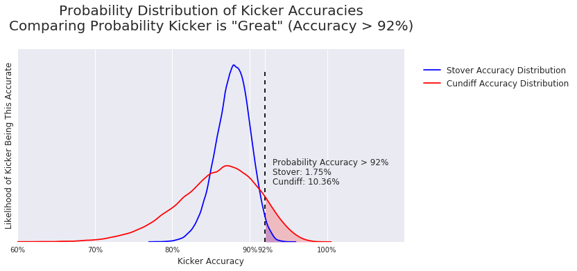

# Jesse Galef Data Science Portfolio Projects

## [1) Quantifying the 'Trumpiness' of Political Speech Using Natural Language Processing](https://github.com/JesseGalef/Portfolio/tree/master/Trumpiest_Sentences)

Summary: Donald Trump and Hillary Clinton have fairly distinct speaking styles on the campaign trail, but what makes them distinct? 

This project scrapes transcripts from CSPAN.org to train a model to identify the most important terms for identifying which candidate said a given sentence, and to find the most emblematic sentence for each (The 'Trumpiest', if you will).

In addition to graphs visualizing the results, I created [an interactive D3 Javascript page](https://rawgit.com/jessegalef/TrumpiestSentences/master/interactive.html) for visitors to play with the results, enter their own sentences for evaluation, and look up terms.

## 2) [Evaluating NFL Play Calling Predictability](https://github.com/JesseGalef/Portfolio/tree/master/NFL_Playcalling) - Controling for multiple non-linear confounding variables using inverse probability of treatment weighting

Summary: There's a curious pattern in NFL play calling, which we think might be the result of coaches' irrationality. But there are so many confounding variables in play - score, time, QB quality, etc. - that we need to control for those first before passing judgement.

The project is an exercise in feature engineering and the 'inverse probability of treatment weighting' technique of controling for confounds. These features were disproportionatly distributed between the groups I was comparing, but became far more similar after being reweighted.

## 3) [Making Judgements on Limited Information](https://github.com/JesseGalef/Portfolio/tree/master/Bayesian_Inference_pymc3_NFL_kickers) - Using Bayesian Inference to Compare Hypothetical Options

This was an example probabalistic programming problem I created for the data science class I was TA'ing. If you have two options, one established and one much newer, how do you judge the probability each is better given the limited information you have?

The project scrapes data from NFL.com to use as a prior distribution, then shows the students how to use the pymc3 library to generate new probability distributions.

P-values address "Given a hypothesis, how likely are we to see this observation?" Bayesian techniques address "Given your observations and prior beliefs, how likely is this hypothesis?"

