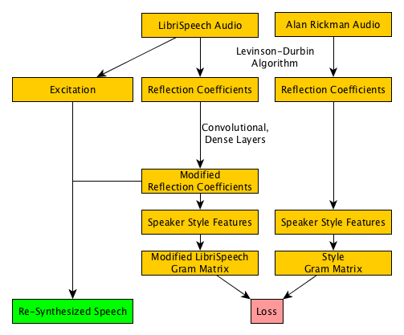
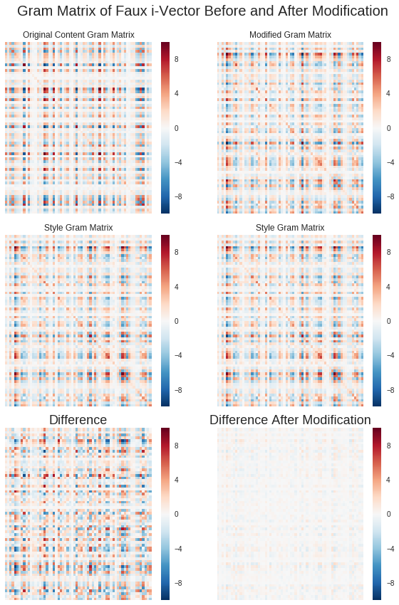

## Comparing Techniques for Audio Style Transfer For Converting One Voice to Another

This project aimed to explore audio style transfer in the domain of speech, comparing how well three different feature extraction methods represent a speaker’s style: AutoRegressive modeling coefficients of the vocal tract, Speaker identification faux i-Vectors, and a wide set of random convolutional filters.

Using these three different feature sets to model a speaker’s style profile, a content audio was modified through a series of convolutional and residual layers to more closely match the speaking style of the late Alan Rickman.

While the neural nets proved capable of converting a given vocal tract profile to match that of the target’s, the modifications proved insufficient to sound as though the resynthesized audio came from a different speaker. By only adjusting the vocal tract information – leaving the vocal cord excitation signal’s pitch and amplitude unchanged – the alterations left out many important subjective elements of Alan Rickman’s voice. Future work could include both elements of the source-filter model in their style transfer and would likely produce higher quality results.

In a desire to learn more about signal processing, many components are coded from scratch rather than using pre- built functions. The TensorFlow Signal module in particular would have made many things possible, but would have masked important concepts.

The project was written and run in Python 3 in Google Colabaratory, which allowed the use of a GPU to train the neural nets and greatly reduce runtime. The notebook can be viewed or run by others, and a link is provided in section 6. [https://colab.research.google.com/drive/157CErdbKP68nU86g5K645Czn5irG8gKL]